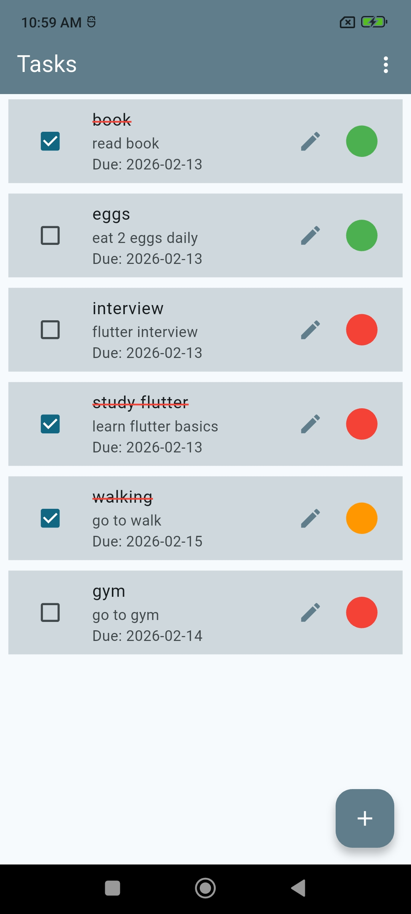
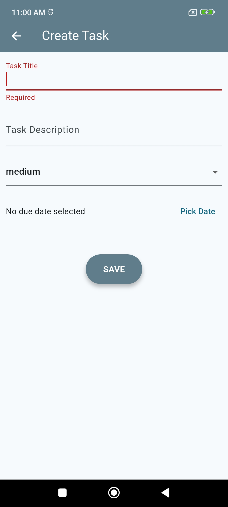
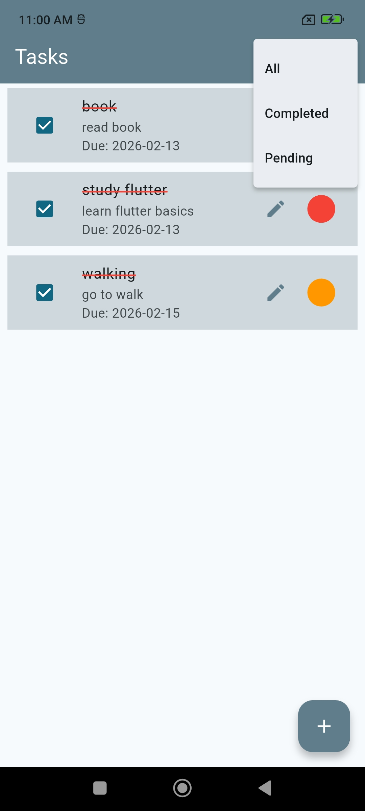
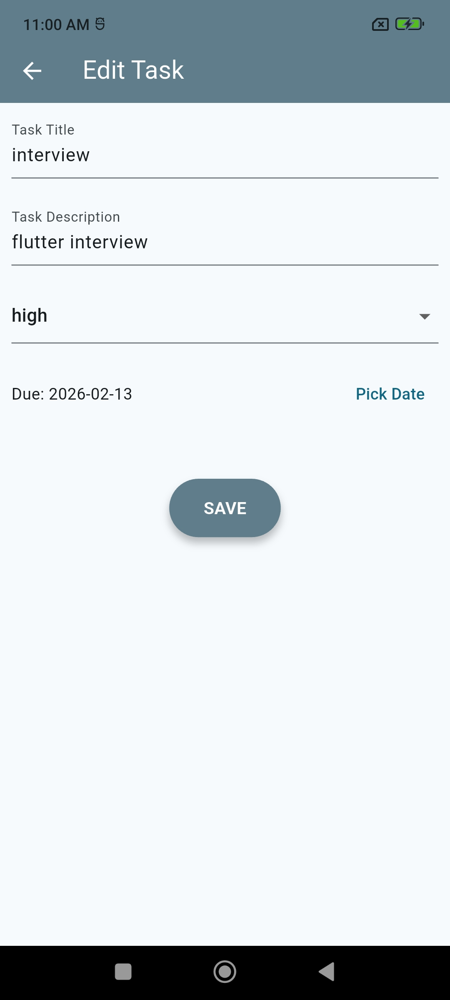

# 📝 Saigeware Task

The app allows users to manage tasks with full offline persistence using Hive and clean separation of concerns using Provider.

## ✨ Features Implemented

- Create, edit, delete tasks
- Mark tasks as completed
- Optional description and due date
- Task priority indicator (Low / Medium / High)
- Offline persistence using Hive
- Task filtering:
  - All
  - Completed
  - Pending
- Swipe to delete (Dismissible)
- Proper empty state when no tasks exist
- Form validation (title required)

## 🧱 Architecture

The project follows a simplified Clean Architecture approach.

lib/ 
 ┣ data/          → Hive model, adapter, local storage 
 ┣ domain/        → Task entity (pure Dart model) 
 ┣ presentation/  → UI screens and TaskProvider

### Why this structure?

- UI is separated from business logic
- Easy to maintain and scale
- Data storage can be replaced without touching UI
- Clear responsibility for each layer

## 🗃️ Offline First (Hive)

Hive was chosen because:

- Lightweight and fast for local storage
- Perfect for simple structured data like tasks
- No need for complex SQL queries
- Persists data between app launches

## 🧠 State Management (Provider)

Provider manages:

- Loading tasks from Hive
- Add / Update / Delete operations
- Filtering logic
- Notifying UI on changes

This keeps logic outside widgets and ensures reactive updates.

## 🎨 UI/UX Decisions

- Priority shown using colored indicator
- Animated task completion for better UX
- Swipe to delete for natural interaction
- Clean form with validation
- Meaningful empty state

## ⚖️ Trade-offs Made

| Decision | Reason |
|----------|--------|
| Hive instead of SQLite | Simpler for key-value task storage |
| Provider instead of Bloc | Less boilerplate for this scale |
| No repository layer | Avoided over-engineering for small app |
| No search/sort | Focused on core requirements |
| Simple UI | Focus on architecture over visuals |

## 🚀 How to Run

flutter pub get 
dart run build_runner build 
flutter run

## 📦 Packages Used

- provider
- hive
- hive_flutter
- build_runner
- hive_generator

## 📸 Screenshots

  
  
  
  

## 👨‍💻 Author

Sebastin Shyam Sundar – Flutter Developer
